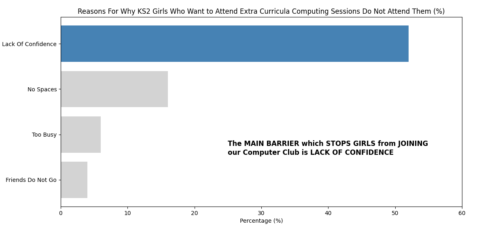

## 🟦📊 **Technique Card: Telling a Story with Your Graphs (deeper)**

### 🕵️‍♀️ What’s this all about?

A graph doesn’t just show data — it tells a _story_. But just like a good book or a powerful speech, it needs to be clear, well-designed, and focused. This card helps you turn a graph into something people understand, remember, and care about.

---

### 🧭 1. Start with a Purpose

Before you even make your graph, ask:

- ❓ _What am I trying to show?_
- 🧠 _What do I want people to notice or remember?_
- 💬 _What message do I want to give?_

> 📌 Example: “Most children walk to school” is a clearer message than just showing five travel options.

---

### 🎯 2. Choose the Right Data

You don’t always need _all_ your data:

- Pick the **most important** or **most interesting** categories.
- Group small or less important ones into **“Other”** if needed.
- Cut clutter so the main idea stands out.

> 🪄 _Too much data = no message. Simpler = stronger._

---

### 🎨 3. Design Matters!

Make your graph easy and pleasant to look at.

**✅ DO:**

- Use _clear labels_ for axes and categories.
- Choose _easy-to-read fonts_.
- Use _contrasting colours_ to show differences.
- Keep background colours _simple or white_.

**🚫 DON’T:**

- Use too many colours or patterns.
- Use silly fonts that are hard to read.
- Squash too much onto one graph.

> 🎨 Tip: Use colours that match the _feeling_ or _theme_. A green colour scheme might work well in an eco project.

---

### 🗨️ 4. Add Annotations or Highlights

Help your audience understand your message faster:

- Add **short labels** to important parts.
- Use **speech bubbles**, **arrows**, or **text boxes** to explain something unusual.
- Circle or colour the **main point**.

> ✍️ Example: “Look how cycling increased after the bike-to-school week!”

---

### 💡 5. Think About Your Audience

Are you sharing your graph with:

- Other children?
- Teachers or parents?
- A website for the public?

Use _words_ and _design_ that match your audience. Keep it friendly and accessible.

> 👩‍🏫 Presenting in PowerPoint? Make sure your graph is big and bold.
>
> 🌍 Publishing on a website? Add a **caption** or **summary sentence** underneath.

---

### 🌟 Final Tips

- ✅ One clear graph is better than five confusing ones.
- ✅ Your graph should speak even when you're not there to explain it.
- ✅ Tell a _story_, not just the numbers.

---

### ✨ Real Example!

As an example from a real piece of research I have included a picture of a key graph. The data collected showed that despite being **more interested** in computing than boys, many girls were not joining extra-curricula computing sessions because they lacked confidence. I needed to make this very clear to other teachers so they could easily appreciate the problem and the need to do something about it.

I kept the graph simple with a strong colour to show my main point and weaker colours for the other bars. I added a bold annotation (along with Donald Trump style use of capital letters TO MAKE MY POINT) which summarized the main point. I also only went to 60% instead of 100% to make the contrast more clear - this was not deceptive since I still clearly showed the numbers.

If the graph had been cluttered with silly fonts and crazy colours it would not have been as effective.

Remember, we are telling stories with data - keep it SIMPLE and TO THE POINT!

---

### 🔗 Linked Cards

- 📊 [Technique Card: Working With CSV Files (practical)](../technique-cards-practical/csv-files.md)
- 📊 [Technique Card: Basic Spreadsheets (practical)](../technique-cards-practical/spreadsheets-basic.md)
- 📊 [Technique Card: Using 2Graph (practical)](../technique-cards-practical/two-graph.md)
- 📊 [Technique Card: Choosing the Correct Graph Type (deeper)](graph-choice.md)

---
