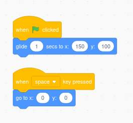
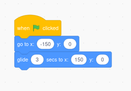

# 🟩🐱 Feature Card: Glide a Sprite

> **Use this when you want a sprite to move smoothly across the screen — like a fish swimming, a spaceship flying, or a balloon drifting.**

---

## 🧠 What is "glide"?

In Scratch, the `glide` block makes a sprite smoothly move to a new position on the stage over a set number of seconds.

This gives a natural-looking movement and is a great way to simulate swimming, flying, floating, or drifting.

---

## 🛠 How to do it

### 📦 Blocks to use:

### 🐠 Example: Glide a Fish

This will make the sprite move from the left side to the right over 3 seconds.

---

### 🧰 Technique Cards (Practical Skills)

These **practical technique cards** can help take your understanding further:

- 🐱 [Technique Card: Coordinates in Scratch](../technique-cards-practical/coordinates-scratch.md)
- 🐱 [Technique Card: Loops in Scratch](../technique-cards-practical/loops-scratch.md)

---

## 🌀 Challenge Yourself!

Try these:

- Make the sprite glide **back and forth** using a loop.
- Combine with `turn` or `point in direction` to change direction before gliding.
- Use `pick random` to glide to **random x and y** spots:

---

## 🧩 Useful Tips

- Shorter seconds = faster glide.
- Use `when this sprite clicked` to glide on click.
- Combine with `repeat` or `forever` for continuous movement.
- Use `if on edge, bounce` if you’re combining glide with other movement styles.

---

## 🎯 When to use this Feature

| **Project Examples**                                                       | **Why Glide Works**                    |
| -------------------------------------------------------------------------- | -------------------------------------- |
| [Virtual Fish Tank](../project-ideas/virtual-fish-tank-scratch-project.md) | Smooth fish movement across the screen |

---

### 📹 Video Link

---
