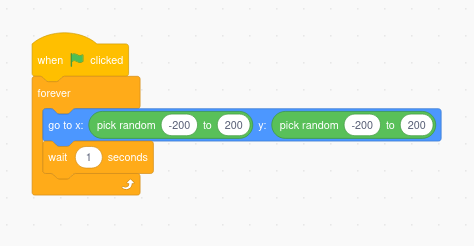
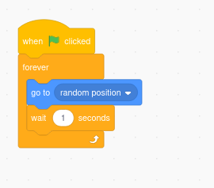
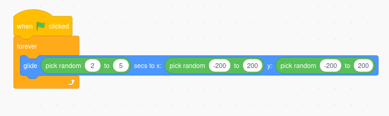
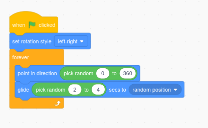
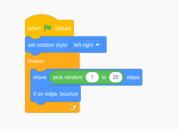

## 🟩🐱 **Feature Card: Random Movement**

**Type:** Feature
**Useful for:** Creating lifelike fish, monsters, random movement, and surprises in Scratch projects

---

### 🧠 What Is It?

Random movement makes your sprite behave **unexpectedly or differently each time**. It adds life to fish in a tank, wandering monsters, or floating space junk. You can make sprites move to **random places**, in **random directions**, or at **random speeds**.

---

### 🧪 You Could Try…

#### 🔹 **Jump to Random Positions**

Use this for teleporting, bubbles popping, or blinking stars:

---

#### 🔹 **Glide to Random Places Smoothly**

Use this to make a fish or ghost glide across the screen:

---

#### 🔹 **Move in Random Directions**

Use this to simulate wandering or swimming:

---

#### 🔹 **Change Speed Randomly**

Change the number of steps the sprite moves each time:

---

### 💡 Combine With

- 🎲 `pick random` (from **Operators**)
- 🔁 Loops (from **Control**)
- 🌊 `glide`, `move`, `go to` (from **Motion**)

---

### 🛠️ Challenges

- Make a sprite glide around like a fish in a tank.
- Create bubbles that pop at random spots.
- Make a monster spawn at a random location every few seconds.
- Add random speed or direction to keep things unpredictable.
- Use random movement + timers to create **“catch the sprite”** style games.

---

### 🧰 Technique Cards (Practical Skills)

These **practical technique cards** can help take your understanding further:

- 🐱 [Technique Card: Coordinates in Scratch](../technique-cards-practical/coordinates-scratch.md)
- 🐱 [Technique Card: Loops in Scratch](../technique-cards-practical/loops-scratch.md)
- 🐱 [Technique Card: Random Numbers in Scratch](../technique-cards-practical/random-numbers-scratch.md)

---

## 🎯 When to use this Feature

| **Project Examples**                                                       | **Why Random Works**                 |
| -------------------------------------------------------------------------- | ------------------------------------ |
| [Virtual Fish Tank](../project-ideas/virtual-fish-tank-scratch-project.md) | Random fish movement around the tank |

---

### 📹 Video Link

---
