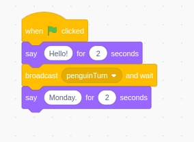
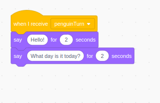

## 🟨🐱 Broadcasting and Receiving Messages in Scratch

**Send messages and make cool things happen in the right order!**

---

### 🧰 What Is This?

Broadcast and receive blocks let parts of your Scratch project **communicate**. You can tell one sprite or backdrop to do something when another one triggers it — **like sending a message behind the scenes**.

Perfect for:

- Changing scenes
- Triggering animations
- Making characters talk in order
- Starting mini-games or challenges

You can even say,

> “Hey! Do your thing — then tell me when you’re done!”

That’s what **Broadcast and Wait** is for!

---

### 🧩 The Blocks

- **`broadcast [message1]`**  
  Sends a message and moves on to the next block straight away.

- **`broadcast [message1] and wait`**  
  Sends a message, **but pauses** until everything listening to that message finishes.

- **`when I receive [message1]`**  
  Starts a script when the message is heard.

> 🧠 Tip: You can create custom messages by clicking the dropdown and selecting “new message…”

---

### 🎮 Try This Example – Synchronized Talking

Let’s have Cat and Penguin talk...

- Add the Penguin sprite.

- Cat’s code:

  

- Penguin’s code:

  

✅ Because Cat uses **broadcast and wait**, she waits for Penguin to finish before speaking again!

---

### 💡 Handy Tips

- Use **`broadcast and wait`** when the sender needs to pause until the message is finished being handled.
- Use plain **`broadcast`** when things can happen in parallel or you don’t need to wait.
- You can broadcast the **same message** to **many sprites**!

---

### 🔍 Use It In…

- Scene changes with loading animations
- Mini-games inside larger projects
- Dialogue sequences
- Reaction chains (like a domino effect!)

---

### 🔍 Look For This In Projects

- Scene changes in story games
- Start Game buttons
- Ending animations
- Surprises after challenges

---

### 🎨 Make It Fun!

- Broadcast a message like `"party time"` and have sprites dance when they receive it!
- Create a mini **dungeon crawler** where characters show when the player enters their part of the "dungeon"

---

### ### 📹 Video Link

---
