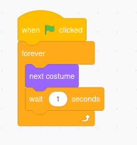
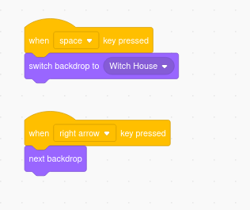
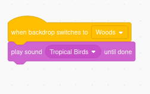

## 🟨🐱 Technique Card: Scratch Costumes and Backdrops (practical)

**Make your sprites and scenes come to life!**

---

### 🔧 What You’ll Learn

- How to switch costumes to animate a sprite
- How to change the backdrop to set the scene
- Where to find and edit costumes and backdrops
- Simple code blocks that let you control them

---

### 🎭 Costumes: Different Looks for a Sprite

Every sprite can have **multiple costumes** — these are like different outfits or poses.

!!! tip
Think of the **sprite** as being the **actor** - only one - who can wear many different **costumes** to look different

#### 🧱 Code blocks to use:

- `switch costume to [costume2]`
- `next costume`

#### 📌 Try it:

1. Click on your sprite.
2. Go to the **Costumes** tab.
3. Add a new costume (draw one, upload, or choose from the library).
4. Use this code to switch:

🔄 This loops through costumes, making the sprite look like it’s **moving** or whatever else you have created with your costumes.

---

### 🎨 Backdrops: Different Scenes for the Stage

The stage can have **multiple backdrops** — perfect for changing scenes in a story or game.

#### 🧱 Code blocks to use:

- `switch backdrop to [backdrop2]`
- `next backdrop`
- `when backdrop switches to [backdrop2]` _(event)_

#### 📌 Try it:

1. Click on the **Stage** in the sprite list.
2. Go to the **Backdrops** tab.
3. Add backdrops (from library or upload your own).
4. Use this code to switch:

🎭 This changes your scene instantly when the **space** key is pressed and moves to each **next backdrop** when the **right arrow** key is pressed.

---

### 💡 Tips for Success

- Use costumes for **sprite animations** (like walking, blinking, changing mood).
- Use backdrops to **move between levels or story chapters**.
- You can also use the **"when backdrop switches to"** block to trigger new events in a story or game.

---

### 🎯 Try These Mini Challenges!

Put your costume and backdrop skills to the test with these fun, focused tasks:

---

#### 🏃 Challenge 1: Walking Animation

Make a sprite appear to walk across the screen by switching between two or more costumes.

📝 _Hint: Move the sprite and use `next costume` with a `wait` block._

---

#### 🌅 Challenge 2: Day and Night Scene

Switch between two backdrops: one for daytime, one for night.  
When you click the green flag, it should change every few seconds.

📝 _Hint: Add a “sunny field” and a “night sky” backdrop from the library._

---

#### 🎭 Challenge 3: Costume Switch with Key Press

Make a sprite change costume when you press the space key.

📝 _Hint: Use the `when space key pressed` block with `next costume`._

---

#### 🎬 Challenge 4: Story Scene Switcher

Create a short story with **3 backdrops**. When the green flag is clicked, the backdrop should change every 2 seconds to move through the story.

📝 _Hint: Use `switch backdrop to` blocks with `wait` commands between them._

---

### 📹 Video Link

---
