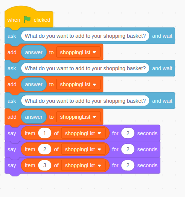
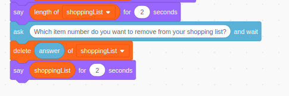

## 🟨🐱 Scratch: Using Lists

### ✨ What You’ll Learn

- How to make a list in Scratch
- How to add, remove, and read items
- Why lists are useful (like saving scores or storing player names)

---

### 🧠 What is a List?

A **list** is like a notebook that stores lots of things **in order**.

- It can hold names, scores, facts—anything made of text or numbers.
- You can **add to it**, **read from it**, or **change** what's inside!

---

### 🛠️ Make a List

1. Click on the **Variables** menu.
2. Click **Make a List** and give it a name like `HighScores` or `ShoppingList`.
3. Choose if it’s **For all sprites** or **This sprite only**.

!!! note
Please see [Technique Card: Variables in Scratch (practical)](./variables-scratch.md) for more info on `For all sprites` and `This sprite only`

---

### 🔧 Useful Blocks

| Block                                     | What it Does                                        |
| ----------------------------------------- | --------------------------------------------------- |
| `add [thing] to [list]`                   | Puts something at the bottom of the list.           |
| `insert [thing] at [1] of [list]`         | Adds something in a specific spot.                  |
| `delete [1] of [list]`                    | Removes an item from the list.                      |
| `replace item [1] of [list] with [thing]` | Changes something already in the list.              |
| `item [1] of [list]`                      | Reads something from the list.                      |
| `length of [list]`                        | Tells how many things are in the list.              |
| `list contains [thing]`                   | Checks if something is in the list (true or false). |

---

### 🎮 Example: Shopping List Game

- Ask the player for 3 fruit names.
- Add each one to the `ShoppingList`.
- Then say them back using `item [1] of [list]`.

- Let the user know how many items are in their shopping list.
- Ask them which item they would like to remove then remove it.
- Say the new and shorter shopping list back to the user.

---

### 🎯 Try This

✅ Make a shopping game which uses a **list** to **store bought items**

✅ Use a **list** to record the names of people invited to the user's birthday party then tell them who they invited.

✅ Store colours in a **list** then say them to the player - can you then work out how to test their memories - they will need to type the colours back in the correct order and your project needs to check if they are correct...

---

### 🐟 Deep Dive

You can learn more about **lists** in general and more specifically Scratch: [Technique Card: Lists in Programming and Scratch in Particular (deeper)](../technique-cards-deeper/lists-scratch-deeper.md)

---

### 📹 Video Link

---
