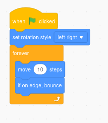
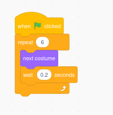
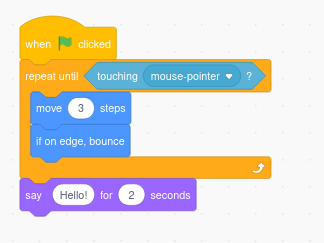

## 🟨🐱 **Technique Card: Using Loops in Scratch**

Looking at how we can **use loops** in our **Scratch projects!**

### 🎯 What Are Loops?

**Loops** let you repeat blocks of code **automatically**, saving time and reducing errors. In Scratch, there are three main loop blocks in the **Control** category:

| Loop Type      | Description                                | Example Use                                |
| -------------- | ------------------------------------------ | ------------------------------------------ |
| `forever`      | Repeats the blocks inside endlessly        | Make a sprite keep swimming                |
| `repeat (10)`  | Repeats the blocks a fixed number of times | Flap wings 10 times                        |
| `repeat until` | Repeats until a condition is met           | Keep moving until mouse pointer is touched |

---

### 🧪 Try It!

**Make a sprite swim forever:**

**Make a sprite flap wings 6 times:**

**Make a sprite move until it touches the mouse pointer:**

---

### 🎓 Top Tips

- **Forever loops** are great for movement, checking for input, or animations that never stop.
- **Repeat loops** are useful when you know how many times something should happen.
- Use **repeat until** with conditions like `touching colour?` or `x position > 200`.

---

### 💡 Handy Blocks to Combine

- `wait (1) seconds` – add a delay between repeats
- `next costume` – animate a sprite
- `if on edge, bounce` – keep sprites within the screen
- `touching ___?` – useful with `repeat until`

---

### 🛠️ Challenges

1. Make a sprite flap its wings 10 times using `repeat`
2. Make a sprite keep gliding across the stage forever using `forever`
3. Use `repeat until` to move a sprite until it reaches a certain x-position

---

### 📹 Video Link

---
