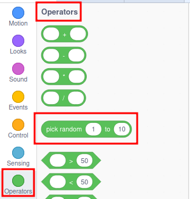
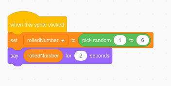
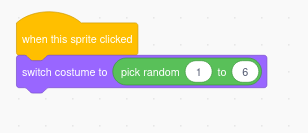

## 🟨🐱 **Random Numbers in Scratch (practical)**

---

### 🎯 What Are Random Numbers?

Scratch has a block that gives you a **random number between and including two values**. This is great for adding **surprises, challenges, or variety** to your projects.

You’ll find it in the **Operators** category (green):

It chooses a random **whole number** (integer) between the two numbers you set.

---

### 🧪 Try It!

**Make a sprite go to a random spot:**

**Roll a dice:**

**Choose a random costume:**

---

### 🎓 Top Tips

- You can use random numbers for:

  - **Random movement** of enemies or fish 🐟
  - **Chance events** in games (like coins falling or powerups appearing)
  - **Generating questions** or puzzles
  - **Making computer decisions** in AI-like games
  - **Visual effects**, like twinkling stars ✨ or popping bubbles

- The numbers don’t have to be positive — you can go from -100 to 100 if you like.

---

### ⚠️ Watch Out!

- The numbers are whole numbers (integers), not decimals.
- The result **includes both ends** — so `pick random 1 to 6` could return 1 **or** 6.

---

### 🛠️ Challenges

1. Make a sprite say a random number between 1 and 100.
2. Use `pick random` in a **repeat** block to move randomly around the screen.
3. Create a **"fortune teller"** that gives a random message when clicked.
4. Build a dice game using random numbers and variables.

---

### 📹 Video Link

---
