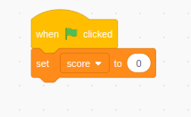
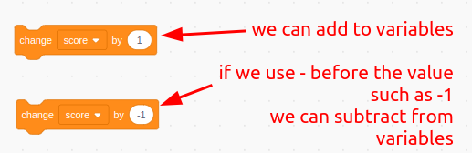
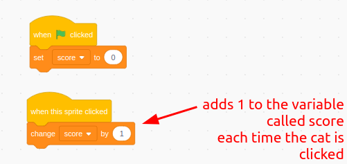

### 🟨🐱 **Scratch: Variables**

**What are these?:**  
A **variable** is like a labelled container that can hold a number or word. You can make your own to keep track of scores, names, answers, and more!

---

### 🛠️ What You Can Do With It:

- 🎯 Keep score in a game
- ⏱️ Count time or tries
- 📦 Store player names or answers
- 📉 Keep track of changing values like distance or energy

---

### 🧰 How To Use It:

1. **Make a Variable**  
   Go to the **Variables** section and click **Make a Variable**.  
   Give it a name like `score` or `playerName`.

2. **Set a Starting Value**  
   Use the block:  
   

   💡 Tip: Put this in the green flag block so it starts fresh!

3. **Change the Value**  
   Use:  
   

   This is great for counting points or keeping score.

4. **Show or Hide It**  
   Use `show variable` or `hide variable` to control whether it appears on the screen.

---

### 🎮 Example:

**Keeping Score in a Game:**

---

### 🔗 Try Using It With:

- 🔢 **Operators** (to do maths with your variable)
- 📣 **Broadcast and Receive** (change variables when something happens)

---

### 🧠 Make It Stick:

- Try making a simple game in which a **variable** controls the **score**
- Can you use a variable to make a timer?

---

### 🧍‍♂️👥 **For All Sprites vs. For This Sprite Only**

When you create a variable, Scratch will ask:

> **"For all sprites"** or **"For this sprite only"?**

Here’s what that means:

| Option                      | What It Means                                                                       | When To Use It                                                                                |
| --------------------------- | ----------------------------------------------------------------------------------- | --------------------------------------------------------------------------------------------- |
| 🟦 **For all sprites**      | The variable can be seen and changed by **any sprite** in your project.             | ✅ Great for scores, timers, and anything that’s shared between characters or the whole game. |
| 🟨 **For this sprite only** | The variable **belongs to just one sprite**. Other sprites **can’t see or use it**. | ✅ Great for things like each sprite having their own health, name, or points.                |

---

### 🎮 Example:

- If you're making a **multiplayer game**, you might give each sprite their own variable:

  - `player1Points` (for Player 1 only)
  - `player2Points` (for Player 2 only)

- If you're making a **single player game**, use a **shared** variable:
  - `score` (for all sprites)

---

### 🧠 Make It Stick:

- Try making a simple game in which **two sprites** move around the screen and **two different speed variables** control the **speed** of each sprite separately so they can move at different speeds to each other.

---

### 📹 Video Link

---
